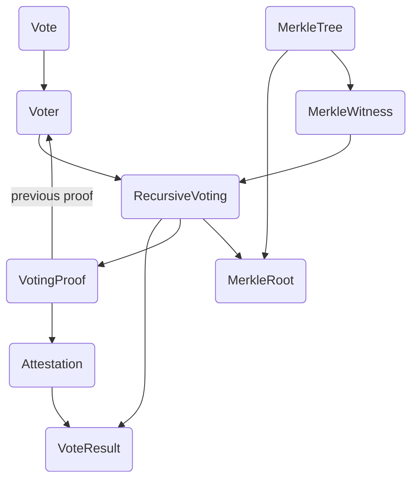
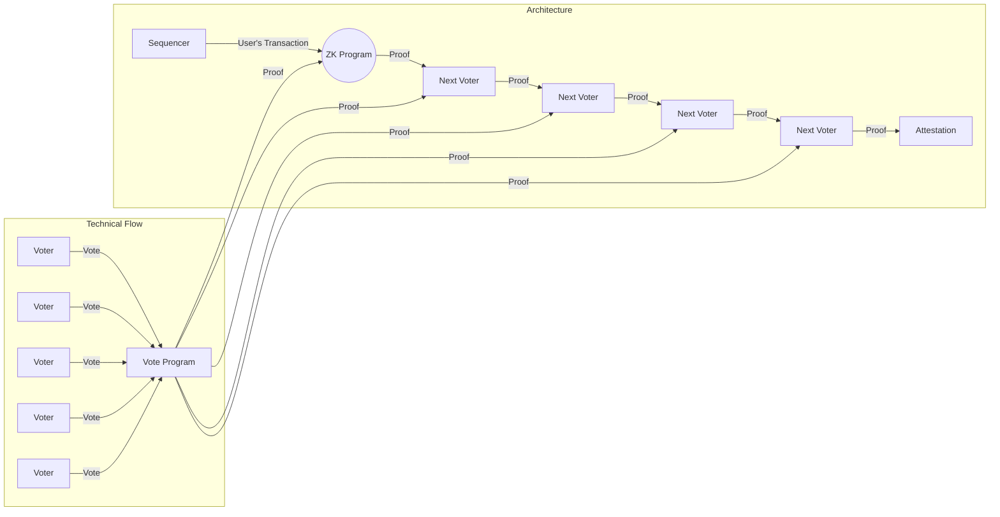

# Mina zkApp: DD Hackathon

# Zero Knowledge Attestation System via consensus voting
This project aims to develop a Zero Knowledge Attestation System using advanced concepts such as recursion from the Mina Protocol. The system allows stakeholders to vote on a specific document through a Voting Contract. If all stakeholders find the document legitimate, they can vote "Yes"; otherwise, they can mark it as "No."

## Table of Content
- [Project Description](#project-description)
- [Repo Description](#repo-description)
- [Technologies Used](#technologies-used)
- [Concepts Used](#concepts-used)
- [Folder Structure](#a-typical-top-level-directory-layout)
- [Install and Run](#install-and-run)
- [Technical Flow](#technical-flow)
- [Functional Flow](#functional-flow)
- [License](#license)


## Project Description
The Zero Knowledge Attestation System utilizes the Mina protocol to make the contracts zero-knowledge compatible. By employing recursion, the system ensures robustness and reduces the number of on-chain transactions required. All voter transactions are conducted off-chain, and the proof is submitted to the smart contract only at the end. This approach ensures that the system remains independent of the number of voters involved, as it will always require just one transaction. The system achieves this without compromising security.

## Repo Description
This repository contains the following programs:
```
`Vote`: This program handles an individual voter's vote.
`Voter`: This program represents an individual voter.
`VoteResult`: This program maintains the overall state of the voting result.
`RecursiveVoting`: This program utilizes recursive snarks (Zero-Knowledge Program) to verify the `vote results`. It takes the VoteResult as public input and verifies both the previous proof and the new vote.
`Attestation`: This Zero-Knowledge application verifies the final proof and publishes the voting result.
```
## Technologies Used 
The Zero Knowledge Attestation System incorporates the following technologies:

**Mina Protocol**: The system leverages the Mina protocol to enable zero-knowledge compatibility in the contracts and utilize recursion for robustness.

**Smart Contracts**: The system utilizes smart contracts to handle the voting process and maintain the integrity of the voting results.

## Concepts Used
The Zero Knowledge Attestation System employs the following concepts:

**Zero-Knowledge Proofs**: By utilizing zero-knowledge proofs, the system ensures that the voting process maintains privacy and confidentiality. It allows participants to prove the validity of their votes without revealing any sensitive information.

**Recursion**: The system utilizes recursion to enable off-chain voting transactions and reduce the number of on-chain transactions. This approach improves scalability and efficiency, as it requires only one transaction to publish the proof and the final result.

**Merkle Trees**: The system utilizes Merkle trees to prevent double voting and ensure the integrity of the voting process. Merkle trees allow for efficient verification of votes while maintaining the security and immutability of the system.

## A typical top-level directory layout
    .
    ├── src                    # Contains all Snarky Js File
    └── README.md

## Technical Flow



## Functional Flow




## Install and Run

- Run `npm install` to install dependencies
- Run `npm run build` to compile
This template uses TypeScript.


## License

[Apache-2.0](LICENSE)

